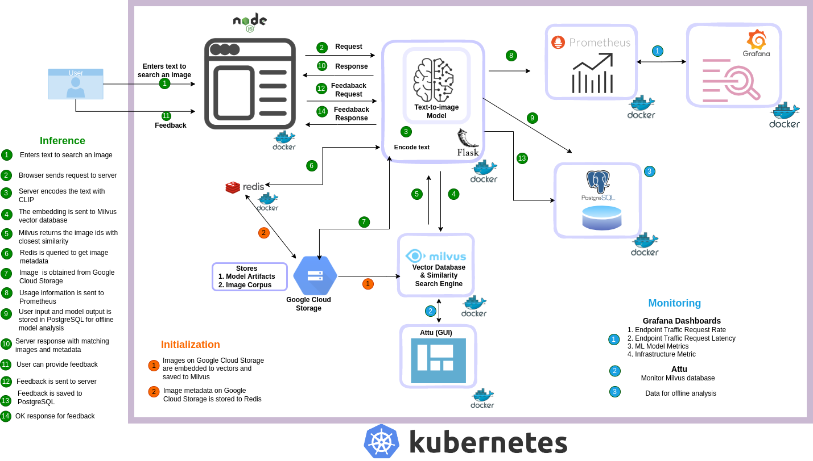

# Semantic Similarity Search Engine with State of the Art Embeddings

## FSDL-2022 PROJECT


        


# System Design




## Quickstart

[Run the project locally](Introduction.md)

# Key Features

1. Generate Embedding for Text-to-Image Similarity Search using OpenAI Clip Model.
2. Perform Vector Similarity Search using  Milvus Vector Database using Approximate Nearest Neighbour Search.
   1. Read more on [Existing Approaches to Vector Data Management and Search](https://milvus.io/blog/scalable-and-blazing-fast-similarity-search-with-milvus-vector-database.md#Existing-Approaches-to-Vector-Data-Management-and-Search)
3. REST API service using Flask to perform Text-to-Image Search.
4. Search Engine User Interface built using Nodejs to perform Text-to-Image Search.
5. Infrastructure Metric and ML Model Metric collection using Prometheus.
6. Infrastructure Metric and ML Model Metric visualization using Grafana.
7. Store Model Results in PostgreSQL Database for Offline Model Evaluation.
8. Store User Feedback on the Search results using Redis.
9. Data Ingestion Pipeline for Storage of Image Corpus on Google Cloud Storage.
10. Data Migration between Google Store and Milvus Vector Database.
11. Building Container Application for the following services:
    1. Search Engine Backend- [ML Inferece Engine]
    2. Search Engine UI
    3. Prometheus
    4. Grafana
    5. PostgreSQL
    6. Milvus
    7. Attu- GUI for Milvus
    8. Redis
12. Container Orchestrate using Docker-Compose on Single Host Machine.
13. Orchestrate Deployment using Kubernetes on Google Cloud.


## Getting Started

## Running on a Single Host Machine using Docker-Compose

### Install Dependencies

```
# clone project 
git clone https://github.com/u6yuvi/fsdl_project.git semsearch
cd semsearch/
git checkout docker_template_exp

# create conda environment
conda create -n semsearch python=3.8
conda activate semsearch
```


1. Install miniconda
2. Clone code and checkout branch


## TODO

1. Integrate Milvus for Preseeding the Image Corpus in the Vector Database to do approximate nearest neighbour search.
3. Use of AWS instance to reproduce the exisiting pipeline.
4. Explore Amazon S3 Object store to fetch Image Corpus for Preseeding in the Vector Database.
5. Adding REST API endpoint for Image to Image Search.
6. Monitoring Logs with Kibana.
